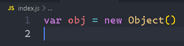
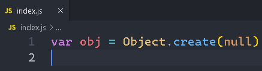
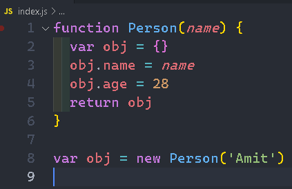
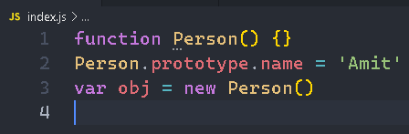
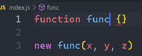
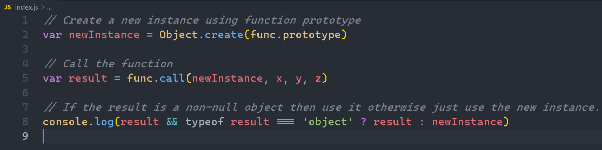
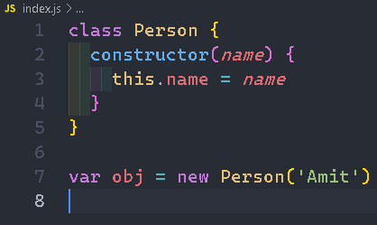

# JavaScript Questions

## Possible ways to create object in JavaScript

#### Object Constructor :-

The simplest way to create an empty object is using the Object constructor.



#### Object's create method :-

The create method of Object creates a new object by passing the prototype object as a parameter.



#### Function constructor :-

Create any function and apply the new operator to create object instances.



#### Function constructor with prototype :-

This is similar to function constructor but it uses prototype for their properties and methods.



This is equivalent to an instance created with an object create method with a function prototype and then call that function with an instance and parameters as arguments.



##### (OR)



#### ES6 class syntax :-

ES6 introduces class feature to create the objects.



#### Singleton pattern :-

A Singleton is an object which can only be instantiated one time. Repeated calls to its constructor return the same instance and this way one can ensure that they don't accidentally create multiple instances.

```javascript
var object = new (function () {
  this.name = 'Amit'
})()
```

## Prototype chain

**Prototype chaining** is used to build new types of objects based on existing ones. It is similar to inheritance in a class based language.

The prototype on object instance is available through **Object.getPrototypeOf(object)** or **_proto_** property whereas prototype on constructors function is available through Object.prototype.
