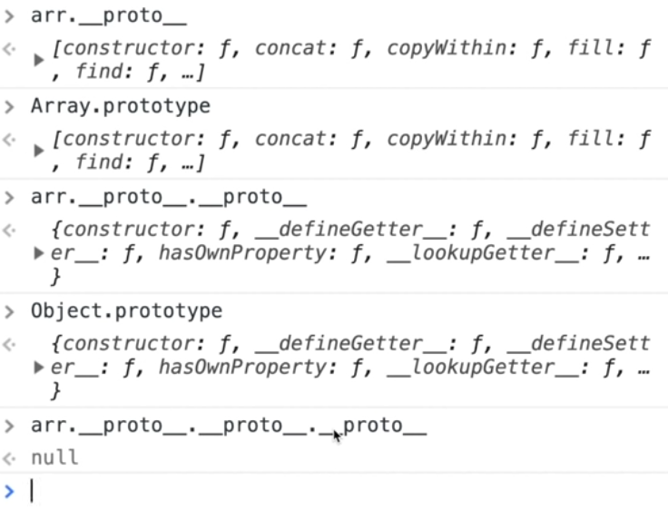
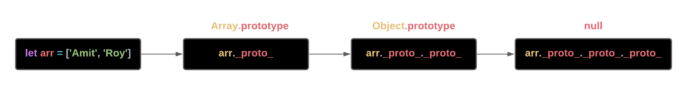
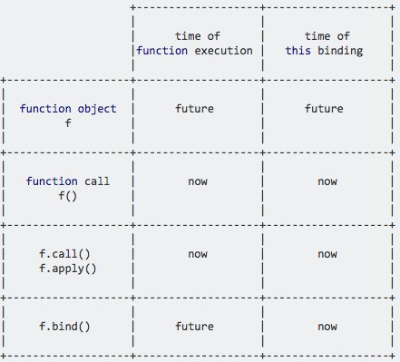

# JavaScript Questions

## Possible ways to create object in JavaScript

#### Object Constructor :-

The simplest way to create an empty object is using the Object constructor.

```javascript
var object = new Object()
```

#### Object's create method :-

The create method of Object creates a new object by passing the prototype object as a parameter.

```javascript
var obj = Object.create(null)
```

#### Function constructor :-

Create any function and apply the new operator to create object instances.

```javascript
function Person(name) {
  var obj = {}
  obj.name = name
  obj.age = 28
  return obj
}

var obj = new Person('Amit')
```

#### Function constructor with prototype :-

This is similar to function constructor but it uses prototype for their properties and methods.

```javascript
function Person() {}
Person.prototype.name = 'Amit'
var obj = new Person()
```

This is equivalent to an instance created with an object create method with a function prototype and then call that function with an instance and parameters as arguments.

```javascript
function func {}

new func(x, y, z)
```

**(OR)**

```javascript
// Create a new instance using function prototype
var newInstance = Object.create(func.prototype)

// Call the function
var result = func.call(newInstance, x, y, z)

// If the result is a non-null object then use it otherwise just use the new instance.
console.log(result && typeof result === 'object' ? result : newInstance)
```

#### ES6 class syntax :-

ES6 introduces class feature to create the objects.

```javascript
class Person {
  constructor(name) {
    this.name = name
  }
}

var obj = new Person('Amit')
```

#### Singleton pattern :-

A Singleton is an object which can only be instantiated one time. Repeated calls to its constructor return the same instance and this way one can ensure that they don't accidentally create multiple instances.

```javascript
var object = new (function () {
  this.name = 'Amit'
})()
```

## Prototype chain

**Prototype chaining** is used to build new types of objects based on existing ones. It is similar to inheritance in a class based language.

The prototype on object instance is available through **Object.getPrototypeOf(object)** or **_proto_** property whereas prototype on constructors function is available through **Object.prototype**.

Whenever we create an object. JS engine automatically attaches an object to our object, and by this way we get access to the default properties and methods.

```javascript
let arr = ['Amit', 'Roy']
arr._proto_._proto_
```



**arr.\_proto\_** is same as **Array.prototype**.

**arr.\_proto\_._proto\_** is same as **Object.prototype**.

**arr.\_proto\_._proto\_._proto\_** is **null**.



## Call, Apply and Bind



**Call** invokes the function with a given **this** value and allow us to pass the arguments one by one.

**Apply** invokes the function with a given **this** value and allow us to pass in arguments as an array.

**Bind** returns a function allowing us to pass any number of arguments.

```javascript
let employee1 = { firstName: 'Jack', lastName: 'Sparrow' }
let employee2 = { firstName: 'John', lastName: 'Carter' }

function invite(greeting1, greeting2) {
  console.log(`${greeting1} ${this.firstName} ${this.lastName}, ${greeting2}`)
}
```

### Call

```javascript
invite.call(employee1, 'Hello', 'How are you?')
invite.call(employee2, 'Hello', 'How are you?')
```

### Apply

```javascript
invite.apply(employee1, ['Hello', 'How are you?'])
invite.apply(employee2, ['Hello', 'How are you?'])
```

### Bind

```javascript
let inviteEmployee1 = invite.bind(employee1)
let inviteEmployee2 = invite.bind(employee2)

inviteEmployee1('Hello', 'How are you?')
inviteEmployee2('Hello', 'How are you?')
```

## Difference between Slice and Splice

| Slice                                        | Splice                                          |
| -------------------------------------------- | ----------------------------------------------- |
| Doesn't modify the original array(immutable) | Modifies the original array(mutable)            |
| Returns the subset of original array         | Returns the deleted elements as array           |
| Used to pick the elements from array         | Used to insert or delete elements to/from array |

## How arrow functions are different from lambda functions

An arrow function is a shorter syntax for a function expression and does not have its own **this**, **arguments**, **super**, or **new.target**.

These functions are best suited for non-method functions, and they cannot be used as constructors.

## First class function

In Javascript, functions are first class objects.

First-class functions means when **functions in that language are treated like any other variable**.

For example, a function can be passed as an argument to other functions, can be returned by another function and can be assigned as a value to a variable, etc.

## First order function

First-order function is a function that **doesn’t accept another function as an argument** and **doesn’t return a function as its return value**.

```javascript
const firstOrder = () => console.log('I am a First Order Function.')
```

## High order function

Higher-order function is a **function that accepts another function as an argument or returns a function as a return value or both**.

```javascript
const firstOrderFunc = () => console.log('I am a First Order Function')

const higherOrder = (returnFirstOrderFunc) => {
  returnFirstOrderFunc()
}

higherOrder(firstOrderFunc)
```

## Unary function

Unary function (i.e. monadic) is a **function that accepts exactly one argument**.

It stands for a single argument accepted by a function.

```javascript
const unaryFunction = (a) => {
  console.log(a + 10)
}
```

## Currying function

Currying is the **process of taking a function with multiple arguments and turning it into a sequence of functions each with only a single argument**.

Currying is named after a mathematician **Haskell Curry**.

By applying currying, a n-ary function turns it into a unary function.

```javascript
const multiArgFunction = (a, b, c) => {
  a + b + c
}

console.log(multiArgFunction(1, 2, 3)) // 6

const curryUnaryFunction = (a) => (b) => (c) => {
  a + b + c
}

curryUnaryFunction(1) // returns a function: b => c =>  1 + b + c

curryUnaryFunction(1)(2) // returns a function: c => 3 + c

curryUnaryFunction(1)(2)(3) // returns the number 6
```

Curried functions are great to improve **code reusability** and **functional composition**.

## Pure function

A **Pure function** is a function where the return value is only determined by its arguments without any side effects.

i.e, If we call a function with the same arguments 'n' number of times and 'n' number of places in the application then it will always return the same value.

```javascript
//Impure
let numberArray = []
const impureAddNumber = (number) => {
  numberArray.push(number)
}

//Pure
const pureAddNumber = (number) => (argNumberArray) => {
  argNumberArray.concat([number])
}

//Display the results
console.log(impureAddNumber(6)) // returns 1
console.log(numberArray) // returns [6]

console.log(pureAddNumber(7)(numberArray)) // returns [6, 7]
console.log(numberArray) // returns [6]
```

As per above code snippets, **Push** function is impure itself by altering the array and returning an push number index which is independent of parameter value.

Whereas **Concat** on the other hand takes the array and concatenates it with the other array producing a whole new array without side effects. Also, the return value is a concatenation of the previous array.

Pure functions are important as they simplify unit testing without any side effects and no need for dependency injection.

They also avoid tight coupling and make it harder to break your application by not having any side effects.

These principles are coming together with **Immutability** concept of ES6 by giving preference to **const** over **let** usage.

## Memorization

Memoization is a programming technique which attempts to **increase a function’s performance by caching its previously computed results**.

Each time a memoized function is called, its parameters are used to index the cache.

If the data is present, then it can be returned, without executing the entire function. Otherwise the function is executed and then the result is added to the cache.

```javascript
const memorizeAddition = () => {
  let cache = {}
  return (value) => {
    if (value in cache) {
      console.log('Fetching from cache')
      return cache[value] // Here, cache.value cannot be used as property name starts with the number which is not a valid JavaScript  identifier. Hence, can only be accessed using the square bracket notation.
    } else {
      console.log('Calculating result')
      let result = value + 20
      cache[value] = result
      return result
    }
  }
}

// returned function from memorizeAddition
const addition = memorizeAddition()

console.log(addition(20)) //output: 40 calculated
console.log(addition(20)) //output: 40 cached
```

## React.memo vs. useMemo Hooks
